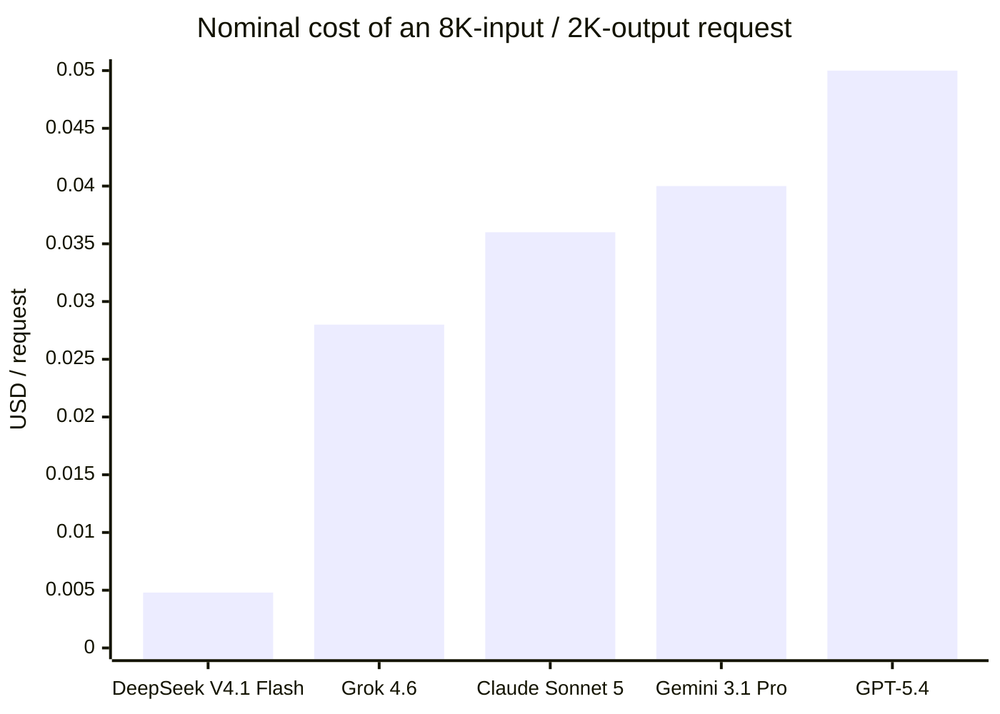
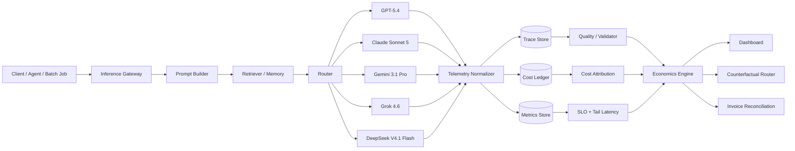
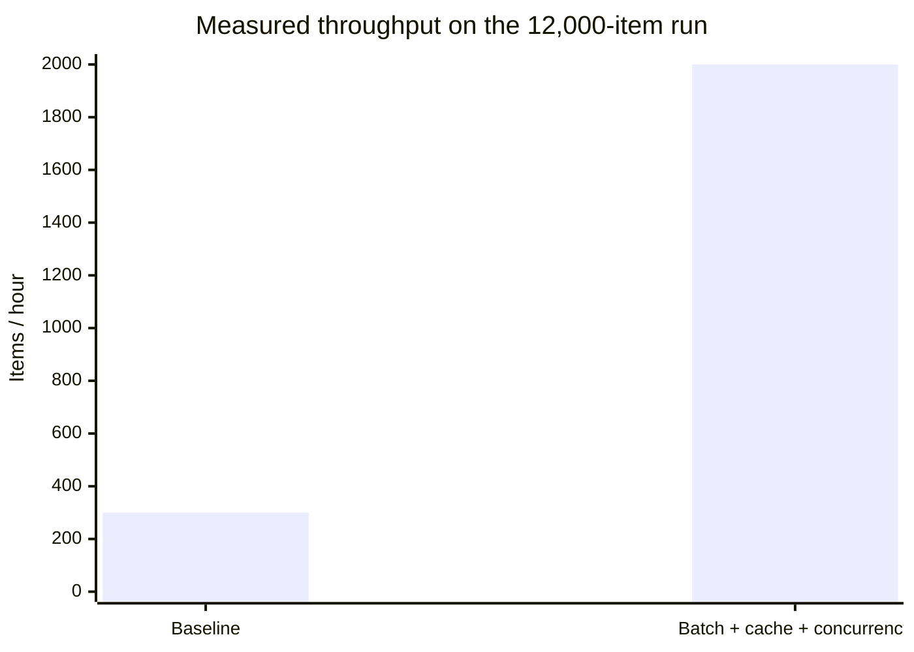
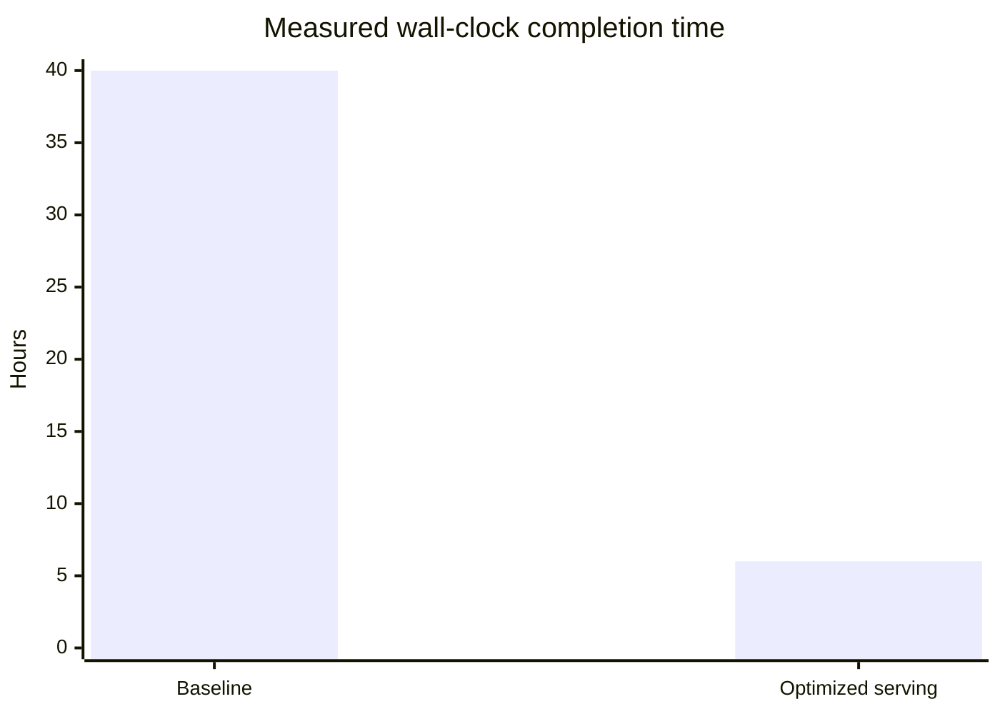
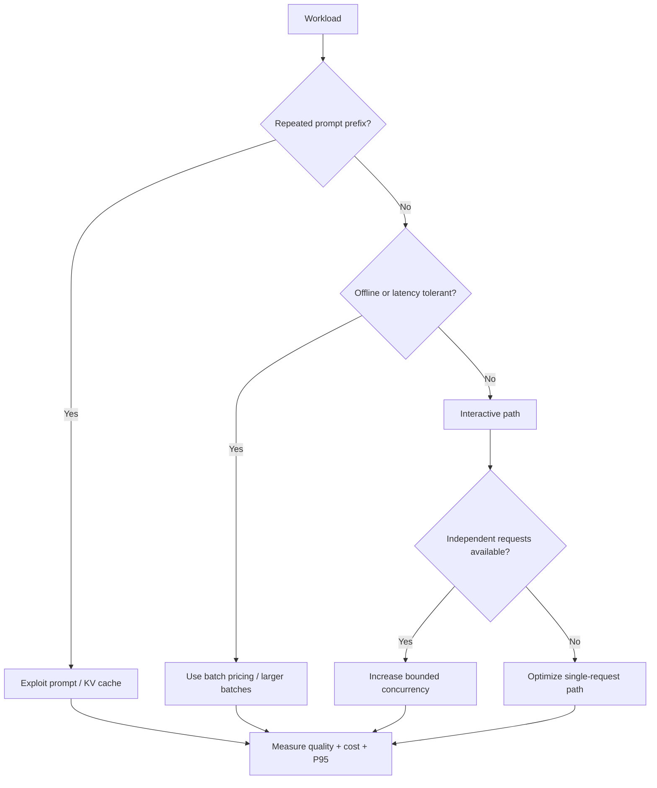
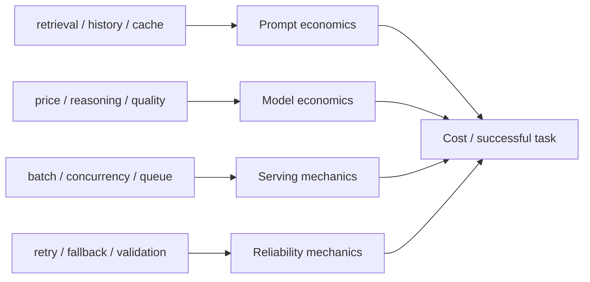

## Inference Ledger: Request-Level Serving Economics

### Serving Cost, Token Usage, and Counterfactual Optimization Across Frontier Models

This project treats inference spend as a systems problem.

A provider invoice answers one question:

> How much did we spend?

The instrumentation layer answers the questions that matter operationally:

> Which workload created the spend? Which prompt component caused it? Which serving decision was responsible? How much of the spend produced a usable result? What would the same workload have cost under a different model, retry policy, cache policy, or context budget?

The result is a **request-level inference ledger**: every LLM call is reconstructed into input, cached input, retrieval context, reasoning, output, retries, fallbacks, latency, quality, and final economic cost.

### Current provider surface: the same request has radically different economics

Pricing snapshot: **September 15, 2026**. Prices below are public standard API rates and should be treated as a point-in-time input to the ledger, not a permanent constant.

| Model | Model ID | Input / 1M | Cached input / 1M | Output / 1M | Context / pricing notes | Source |
|---|---|---:|---:|---:|---|---|
| OpenAI GPT-5.4 | `gpt-5.4` | **$2.50** | **$0.25** | **$15.00** | 1.05M context; >272K input triggers higher long-context pricing | [OpenAI](https://developers.openai.com/api/docs/models/gpt-5.4) |
| Anthropic Claude Sonnet 5 | `claude-sonnet-5` | **$2.00** | Prompt caching supported | **$10.00** | Anthropic advertises up to 90% savings from prompt caching and 50% from batch processing | [Anthropic](https://www.anthropic.com/news/claude-sonnet-5) |
| Google Gemini 3.1 Pro Preview | `gemini-3.1-pro-preview` | **$2.00** | **$0.20** | **$12.00** | <=200K-token tier; batch is $1/$6; >200K rises to $4/$18 | [Google](https://ai.google.dev/gemini-api/docs/pricing) |
| xAI Grok 4.6 | `grok-4.6` | **$2.00** | **$0.50** | **$6.00** | 500K context; >=200K uses $4/$1/$12 long-context pricing | [xAI](https://docs.x.ai/developers/pricing) |
| DeepSeek V4.1 Flash | `deepseek-flash` | **$0.30 peak** | **$0.006 peak** | **$1.20 peak** | Off-peak is 50% lower; 1M context; 2,500 concurrency limit | [DeepSeek](https://api-docs.deepseek.com/quick_start/pricing/) |

That table already shows why a single field called `token_cost` is not enough. The cost function is provider-, model-, tier-, time-, cache-, and context-dependent.

For an **8K-input / 2K-output** request with no cache hits:

```math
C_{request}
=
8{,}000p_{in}
+
2{,}000p_{out}
```

| Model | Cost / request | Cost / 12K requests |
|---|---:|---:|
| DeepSeek V4.1 Flash, peak | **$0.0048** | **$57.60** |
| Grok 4.6 | **$0.0280** | **$336.00** |
| Claude Sonnet 5 | **$0.0360** | **$432.00** |
| Gemini 3.1 Pro Preview | **$0.0400** | **$480.00** |
| GPT-5.4 | **$0.0500** | **$600.00** |



This is **not a model recommendation**. It is the first line of the cost ledger. Quality, retry rate, reasoning effort, latency, cacheability, long-context pricing, and batch eligibility can all reorder the result.

<details>
<summary><strong>What happens if 50% of the input is served from cache?</strong></summary>

For providers with an explicit cached-input rate in the public table above, let half of the 8K-token prompt be cached:

```math
C_{50\%\ cache}
=
4{,}000p_{in}
+
4{,}000p_{cached}
+
2{,}000p_{out}
```

| Model | No-cache cost | 50% cached-input cost | Reduction |
|---|---:|---:|---:|
| DeepSeek V4.1 Flash, peak | $0.004800 | **$0.003624** | **24.5%** |
| Grok 4.6 | $0.028000 | **$0.022000** | **21.4%** |
| Gemini 3.1 Pro Preview | $0.040000 | **$0.032800** | **18.0%** |
| GPT-5.4 | $0.050000 | **$0.041000** | **18.0%** |

The cache hit rate alone is not the metric. The economic variable is **dollars avoided per cache hit after cache infrastructure and write costs**.

</details>

### The architecture: instrument the gateway, not the invoice



The gateway emits a trace before and after every model call. Provider-specific usage is normalized into a common schema so that a GPT request and a Claude request can be compared without losing provider-specific details.

OpenTelemetry now defines GenAI semantic attributes for input, output, cached, and reasoning-token usage. Langfuse similarly models usage as mutually exclusive buckets and explicitly warns that inclusive provider counters can otherwise double-count cached tokens. The instrumentation follows that principle rather than treating each provider response as directly comparable.

- [OpenTelemetry GenAI semantic conventions](https://opentelemetry.io/docs/specs/semconv/registry/attributes/gen-ai/)
- [Langfuse token and cost tracking](https://langfuse.com/docs/observability/features/token-and-cost-tracking)

### The canonical request ledger

Every model call becomes one row in an immutable serving ledger.

```json
{
  "trace_id": "tr_01J...",
  "request_id": "req_01J...",
  "logical_task_id": "task_12f7...",
  "timestamp": "2026-09-15T18:42:13.441Z",

  "workload": "rag_document_extraction",
  "tenant": "enterprise_a",
  "prompt_version": "extract-v17",
  "router_version": "router-2026-09-15",

  "provider": "openai",
  "model": "gpt-5.4",
  "reasoning_effort": "medium",

  "tokens": {
    "system": 812,
    "user": 421,
    "retrieval": 6380,
    "history": 2410,
    "tool_input": 0,
    "cached_input": 7012,
    "uncached_input": 3011,
    "reasoning_output": 1550,
    "visible_output": 328
  },

  "latency_ms": {
    "queue": 42,
    "ttft": 610,
    "generation": 2840,
    "total": 3492
  },

  "execution": {
    "attempt": 2,
    "retry_reason": "schema_validation",
    "fallback": false,
    "batch_size": 16,
    "cache_hit": true
  },

  "quality": {
    "validator_pass": true,
    "schema_valid": true,
    "score": 0.93
  },

  "cost_usd": {
    "uncached_input": 0.00753,
    "cached_input": 0.00175,
    "output": 0.02817,
    "tooling": 0.00000,
    "total": 0.03745
  }
}
```

The numbers above are a **schema example**.

### Token accounting: input is not one thing

A conventional dashboard reports `input_tokens` and `output_tokens`. That hides the main optimization surface.

The ledger decomposes prompt tokens as:

```math
T_{in}
=
T_{system}
+
T_{user}
+
T_{history}
+
T_{retrieval}
+
T_{tool}
```

and separates cached from uncached input:

```math
T_{in}
=
T_{cached}
+
T_{uncached}
```

The billable request is then reconstructed as:

```math
C_{request}
=
p_{uncached}T_{uncached}
+
p_{cached}T_{cached}
+
p_{output}(T_{reasoning}+T_{visible})
+C_{tools}
```

This is especially important for reasoning models. Reasoning tokens may not be visible in the final answer but can still be billed as output. Langfuse notes that reasoning-model cost cannot be reconstructed correctly from visible text alone when the provider does not expose the hidden token usage.

### A cost waterfall, not a monthly total

The dashboard should make a request explainable in one screen.

```text
Logical task: task_12f7...
Model: GPT-5.4 / medium reasoning

Prompt construction
  System prompt                812 tok     $0.0020
  User input                   421 tok     $0.0011
  Retrieval context          6,380 tok     $0.0160
  Conversation history       2,410 tok     $0.0060
  Cache credit              -7,012 tok    -$0.0158

Generation
  Reasoning output           1,550 tok     $0.0233
  Visible answer               328 tok     $0.0049

Reliability
  Retry #1 failed schema                  +$0.0317
  Retry #2 passed                         +$0.0375

-----------------------------------------------
Successful logical task                     $0.0692
```

A monthly invoice would report `$0.0692` as spend. The ledger shows that the real issue may be **6,380 retrieval tokens plus a schema-validation retry**, not the model's list price.

### Define productive spend and wasted spend

A model call is not automatically useful just because the provider billed it.

Define:

```math
C_{waste}
=
C_{failed}
+C_{retry\ overhead}
+C_{discarded}
+C_{timeout}
+C_{duplicate}
```

and:

```math
Waste\ Rate
=
\frac{C_{waste}}{C_{total}}
```

The system should expose both `provider_spend` and `productive_spend`.

```text
$18,420  TOTAL MODEL SPEND
│
├── $13,980  productive final-path inference
├── $ 1,610  retry overhead
├── $ 1,120  failed / discarded generations
├── $   930  excess retrieval context
├── $   470  duplicate work
└── $   310  timeout / fallback overhead
```

The values above illustrate the dashboard form. Real deployment values are populated from the ledger.

### Cost per successful task is the primary unit

A request is an API event. A task is the economic unit.

If logical task `j` takes `N_j` attempts:

```math
C_j^{task}
=
\sum_{a=1}^{N_j} C_{ja}
```

The dashboard therefore reports:

```text
Average API-call cost         $0.021
Average successful-task cost  $0.034
                         ───────────
Retry / fallback wedge        $0.013
```

This wedge is where cheap models can stop being cheap.

### Retry-adjusted breakeven: when does the cheap model lose?

Let a cheaper model have attempt cost `c_L` and first-attempt success probability `q_L`. Let the stronger model have `c_H`, `q_H`.

Under the simple independent-retry approximation:

```math
E[C_L]
=
\frac{c_L}{q_L}
```

```math
E[C_H]
=
\frac{c_H}{q_H}
```

The low-cost model is no longer cheaper when:

```math
\frac{c_L}{q_L}
>
\frac{c_H}{q_H}
```

or equivalently:

```math
q_L
<
\frac{c_L q_H}{c_H}
```

The production system does not stop at the independence approximation. It measures retry transition probabilities directly:

```math
P(S_2\mid F_1),
\quad
P(S_3\mid F_1,F_2)
```

because repeated failures are often correlated. If a model misunderstands the task on attempt one, regenerating with the same context may be much less useful than the headline success rate implies.

For a two-attempt policy:

```math
E[C]
=
c_1
+
P(F_1)c_2
```

with success probability:

```math
P(S)
=
P(S_1)
+
P(F_1)P(S_2\mid F_1)
```

The retry dashboard should therefore show a **measured transition matrix**, not only a scalar retry rate.

### The 12,000-item run: measure the serving system, not just the model

The measured workload contained **12,000 independent items**.

Baseline wall-clock time:

```math
T_0 = 40\,\text{hours}
```

Optimized wall-clock time:

```math
T_1 = 6\,\text{hours}
```

Throughput therefore rose from:

```math
\frac{12{,}000}{40}
=
300\,\text{items/hour}
```

to:

```math
\frac{12{,}000}{6}
=
2{,}000\,\text{items/hour}
```

for a measured throughput multiplier of:

```math
\frac{2{,}000}{300}
\approx
6.67\times
```





The project does **not** attribute arbitrary percentages of the improvement to batching, caching, or concurrency without an ablation run. The correct next experiment is:

| Run | Batching | Cache | Concurrency | Wall time | Cost/task | P95 latency | Retry rate |
|---|---|---|---:|---:|---:|---:|---:|
| Baseline | Off | Off | 1 | **40 h measured** | — | — | — |
| A | On | Off | 1 | instrument | instrument | instrument | instrument |
| B | Off | On | 1 | instrument | instrument | instrument | instrument |
| C | Off | Off | N | instrument | instrument | instrument | instrument |
| Full | On | On | N | **6 h measured** | instrument | instrument | instrument |

That turns “40 hours to 6” from an anecdote into a decomposable systems result.

### Concurrency, batching, and caching solve different problems

They should never be presented as interchangeable optimizations.

**Concurrency** raises aggregate throughput by overlapping independent requests. It can reduce total job time without reducing the token bill.

```math
Throughput
=
\frac{N_{completed}}{T_{wall}}
```

**Batching** can reduce per-unit serving cost or improve hardware/provider utilization, but may increase queueing latency. Google currently prices Gemini 3.1 Pro batch processing at **$1/M input and $6/M output**, half its standard <=200K pricing. Anthropic advertises **50% batch savings** for Sonnet 5.

**Caching** reduces repeated input processing. Its value depends on the provider-specific cache discount and the reuse pattern. DeepSeek's V4.1 Flash peak cache-hit input rate is **$0.006/M**, compared with **$0.30/M** for a cache miss—a 50× rate difference on the cached portion. GPT-5.4's published cached-input rate is one-tenth its standard input price.

This means the optimization surface is workload-dependent:



### Context efficiency: retrieval can be the hidden tax

For RAG workloads, the retrieval layer often controls more spend than the user query.

Define retrieval amplification:

```math
RA
=
\frac{T_{retrieval}}{T_{user}}
```

A 300-token question with 8,000 retrieved tokens has:

```math
RA
=
\frac{8{,}000}{300}
\approx
26.7\times
```

That is not automatically bad. It is only bad if the extra context does not buy enough quality.

The instrument should estimate a **context efficiency frontier**:

| Retrieval budget | Validator quality | Cost/task | Decision |
|---:|---:|---:|---|
| 2K | measured | measured | candidate |
| 4K | measured | measured | candidate |
| 8K | measured | measured | candidate |
| 16K | measured | measured | candidate |

Then solve:

```math
k^*
=
\arg\min_k C(k)
```

subject to:

```math
Q(k)
\geq
Q^*
```

This turns `top_k` from a retrieval hyperparameter into an economic control.

### Cache economics: hit rate is not enough

The cache dashboard should not celebrate a 40% hit rate unless those hits are economically meaningful.

Let:

- `h` = effective cache-hit probability
- `C_m` = cost on a miss
- `C_h` = cost on a hit
- `C_cache` = amortized cache storage / lookup / write cost per request

Then:

```math
E[C]
=
hC_h
+(1-h)C_m
+C_{cache}
```

Savings versus no cache are:

```math
S
=
C_m-E[C]
```

The breakeven hit rate is:

```math
h^*
=
\frac{C_{cache}}{C_m-C_h}
```

This matters because provider economics differ sharply. A cache policy that is trivial to justify for DeepSeek V4.1 Flash's 50× peak input-rate discount may have a different breakeven point on another provider, and semantic caching adds its own quality risk.

### Long-context cliffs belong in the router

Pricing functions are not always linear.

GPT-5.4 applies higher rates when prompts exceed **272K input tokens**. Gemini 3.1 Pro moves from **$2/$12** to **$4/$18** above **200K tokens**. Grok 4.6 moves from **$2/$0.50/$6** to **$4/$1/$12** for long context at **>=200K tokens**.

The gateway should therefore emit a `pricing_tier` and treat context thresholds as discontinuities:

```math
C(T)
=
\begin{cases}
C_{short}(T), & T < T^* \
C_{long}(T), & T \ge T^*
\end{cases}
```

A 199K-token prompt and a 201K-token prompt can have materially different marginal economics even when the content difference is tiny.

That makes context compaction, summarization, and retrieval filtering financially measurable.

### Model routing: log the decision that was *not* taken

A serving ledger is much more useful if it stores the counterfactual model set at routing time.

For each logical task, capture:

```json
{
  "chosen_model": "claude-sonnet-5",
  "eligible_models": [
    "gpt-5.4",
    "claude-sonnet-5",
    "gemini-3.1-pro-preview",
    "grok-4.6",
    "deepseek-flash"
  ],
  "quality_floor": 0.92,
  "latency_slo_ms": 6000,
  "estimated_counterfactual_cost": {
    "gpt-5.4": 0.0500,
    "claude-sonnet-5": 0.0360,
    "gemini-3.1-pro-preview": 0.0400,
    "grok-4.6": 0.0280,
    "deepseek-flash": 0.0048
  }
}
```

Those cost numbers use the simple 8K/2K nominal example. A real router additionally conditions on workload-specific measured quality, cache eligibility, retry probability, context tier, and latency.

Then the optimization is explicit:

```math
i^*
=
\arg\min_i E[C_i^{task}]
```

subject to:

```math
Q_i \geq Q^*
```

```math
P95_i \leq L^*
```

The ledger can now compute **routing regret**:

```math
Regret_j
=
C_{chosen,j}
-
\min_{i\in feasible_j} C_{i,j}
```

and total avoidable spend:

```math
Avoidable\ Spend
=
\sum_j \max(Regret_j,0)
```

That is a much stronger metric than “model mix.”

### Cost regression becomes an observability incident

The system maintains rolling baselines for each workload and prompt version.

For cost per successful task:

```math
\mu_{C,w},\quad \sigma_{C,w}
```

A simple alert is:

```math
C_t
>
\mu_{C,w}+3\sigma_{C,w}
```

For heavy-tailed workloads, median/MAD thresholds are more robust.

The useful part is the decomposition:

```text
COST REGRESSION — rag_document_extraction / extract-v18

Cost per successful task      +37.2%

Attribution
  Retrieval context           +18.4 pp
  Reasoning output            +10.7 pp
  Retry frequency              +5.8 pp
  Visible output length        +2.3 pp

Likely change
  prompt_version v17 -> v18
  retrieval top_k 6 -> 12
```

FinOps becomes debugging.

### Invoice reconciliation is the correctness test

The bottom-up ledger should reconcile against provider billing.

```math
Reconciliation\ Error
=
\frac{|C_{ledger}-C_{provider}|}{C_{provider}}
```

A production target can be defined, for example:

```math
|Error| < 1\%
```

Discrepancies are classified rather than silently absorbed:

- stale pricing table
- batch discount not applied
- cached tokens double counted
- tool/search fee missing
- long-context tier not recognized
- event dropped from telemetry
- duplicate span
- provider adjustment / credit

This is especially important because usage schemas differ. Langfuse explicitly notes that OpenAI-style `prompt_tokens` may include cached tokens and must be normalized into exclusive buckets to avoid double counting.

### Core dashboard

#### 1. Spend anatomy

```text
TOTAL SPEND   $18.4K

Model output / reasoning   ████████████████████  52%
Uncached prompt             ███████████           28%
Retrieved context           █████                  9%
Retries / failures          ████                   7%
Tools + other               ██                     4%
```

#### 2. Unit economics

```text
Cost / API call                $0.021
Cost / successful task         $0.034
Cost / 1K source documents     $34.20
Retry waste rate                8.2%
Cache-adjusted input share     41.7%
Retrieval amplification       12.4x
```

#### 3. Serving SLO

```text
Throughput                   2,000 items/hour
Wall-clock run                   6.0 hours
P50 latency                       instrumented
P95 latency                       instrumented
P99 latency                       instrumented
Provider throttle rate            instrumented
```

#### 4. Counterfactual savings

```text
ROUTING / SERVING OPPORTUNITIES

Model down-routing           $X / month
Prompt-cache reuse           $X / month
Retrieval-budget reduction   $X / month
Retry-policy change          $X / month
Batch migration              $X / month
Off-peak scheduling          $X / month
```

The dashboard only reports savings that can be recomputed from logged events and current price-table versions.

### Queries the instrument should answer in one line

```sql
-- Which prompt version increased serving cost the most this week?
SELECT prompt_version,
       AVG(cost_per_successful_task) AS unit_cost,
       COUNT(*) AS tasks
FROM task_ledger
WHERE ts >= NOW() - INTERVAL '7 days'
GROUP BY prompt_version
ORDER BY unit_cost DESC;
```

```sql
-- How much spend came from retrieval context rather than user input?
SELECT workload,
       SUM(cost_retrieval) / SUM(cost_total) AS retrieval_cost_share
FROM task_ledger
GROUP BY workload
ORDER BY retrieval_cost_share DESC;
```

```sql
-- Which model has the lowest realized cost after retries?
SELECT model,
       SUM(cost_total) / SUM(CASE WHEN validator_pass THEN 1 ELSE 0 END)
           AS cost_per_success
FROM task_ledger
GROUP BY model
ORDER BY cost_per_success;
```

```sql
-- Which workloads have the largest routing regret?
SELECT workload,
       SUM(routing_regret_usd) AS avoidable_spend
FROM task_ledger
GROUP BY workload
ORDER BY avoidable_spend DESC;
```

### What is actually measured vs. What is modeled

A serious serving report should keep these categories separate.

| Layer | Examples | Treatment |
|---|---|---|
| **Measured** | 12,000 items; 40 h -> 6 h; actual token counts; actual retry events; actual TTFT | Primary evidence |
| **Provider fact** | GPT-5.4 $2.50/$15; Gemini batch pricing; DeepSeek off-peak rates | Versioned price table with source + capture date |
| **Derived** | items/hour; cost/task; retry waste; reconciliation error | Deterministic calculation from measured data |
| **Modeled** | counterfactual routing; cache breakeven; alternate retry policy | Explicit assumptions + sensitivity |
| **Illustrative** | example JSON event; example dashboard dollar decomposition | Labeled as UI / schema examples |

This separation is important. It prevents a dashboard mock-up from quietly becoming “benchmark data.”

### Why this becomes an economics system, not just a logging system

The instrument exposes four different levers that are usually collapsed into one monthly number:



A provider can cut its token price and still become more expensive for the workload if reasoning-token use rises sharply. A model with a higher sticker price can become cheaper if it avoids retries. A cache can look successful by hit rate and still fail economically. A 200K-token context boundary can dominate an otherwise minor prompt change. A concurrency change can cut wall time 6× without changing the token bill at all.

The request ledger makes those effects separable.


### Primary metrics

| Metric | Definition | Why it matters |
|---|---|---|
| Cost / successful task | total task spend / validated tasks | Correct unit economics |
| Waste rate | failed + discarded + redundant spend / total | Measures recoverable spend |
| Retry wedge | successful-task cost − first-attempt cost | Makes quality failures economic |
| Retrieval amplification | retrieval tokens / user tokens | Detects RAG context bloat |
| Cache ROI | avoided model spend − cache cost | Separates useful hits from vanity hits |
| Routing regret | chosen cost − cheapest feasible cost | Measures model-selection inefficiency |
| Reconciliation error | ledger vs. provider invoice | Validates the measurement system |
| P95 / P99 latency | tail service time | Prevents cost optimization from breaking SLO |
| Throughput | successful items / wall-clock hour | Batch serving efficiency |
| Long-context incidence | requests crossing provider price cliff | Detects avoidable tier jumps |

### Bottom line

A useful cost system therefore has to observe the entire path:

```text
prompt
  -> retrieval
  -> cache
  -> routing
  -> model
  -> reasoning
  -> validation
  -> retry / fallback
  -> successful task
```

and price every step.

The 12,000-item run demonstrates the serving side: **40 hours became 6 hours, increasing realized throughput from 300 to 2,000 items per hour without requiring a headline model-price change.** The instrumentation layer makes that improvement auditable and gives the next optimization a target.

The strongest output of the system is not a spend chart. It is a statement like:

> **Prompt v18 increased retrieval tokens by 2.4×, pushed 7% of Gemini requests above the 200K long-context pricing tier, raised retry-adjusted cost per successful task by 31%, and created $X of avoidable weekly spend. Reducing `top_k` from 12 to 6 preserves the measured quality floor and removes most of the regression.**

That is the difference between observing an invoice and understanding inference economics.

### Sources and live pricing references

- [OpenAI — GPT-5.4 model and pricing](https://developers.openai.com/api/docs/models/gpt-5.4)
- [Anthropic — Claude Sonnet 5](https://www.anthropic.com/news/claude-sonnet-5)
- [Google — Gemini API pricing](https://ai.google.dev/gemini-api/docs/pricing)
- [Google — Gemini 3.1 Pro model](https://ai.google.dev/gemini-api/docs/models/gemini-3.1-pro-preview)
- [xAI — Grok 4.6](https://docs.x.ai/developers/models/grok-4.6)
- [xAI — API pricing](https://docs.x.ai/developers/pricing)
- [DeepSeek — Models & Pricing](https://api-docs.deepseek.com/quick_start/pricing/)
- [DeepSeek — V4.1 Flash release](https://www.deepseek.com/en/news/deepseek-v4-1-flash/)
- [OpenTelemetry — GenAI semantic attributes](https://opentelemetry.io/docs/specs/semconv/registry/attributes/gen-ai/)
- [Langfuse — Token & Cost Tracking](https://langfuse.com/docs/observability/features/token-and-cost-tracking)
