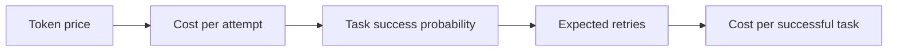
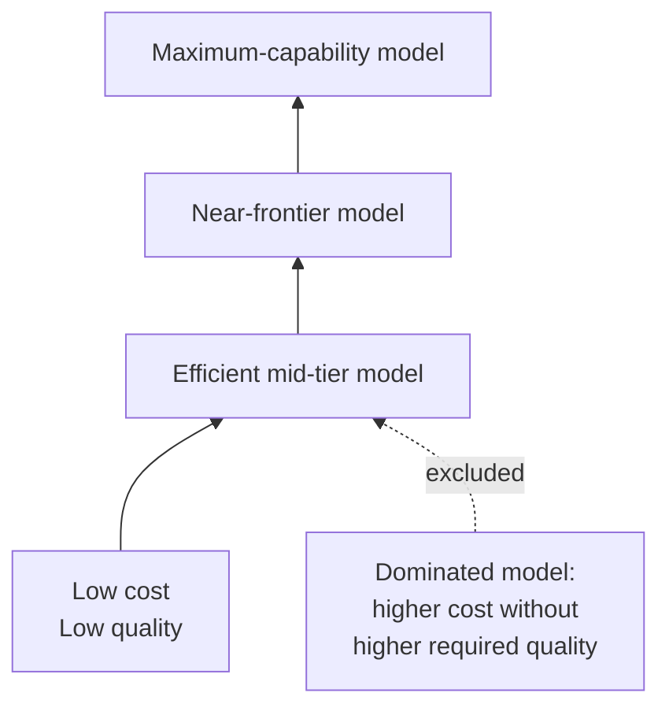
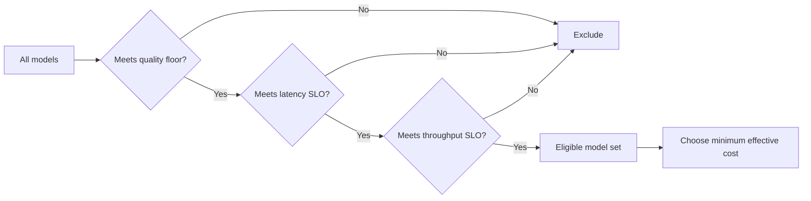
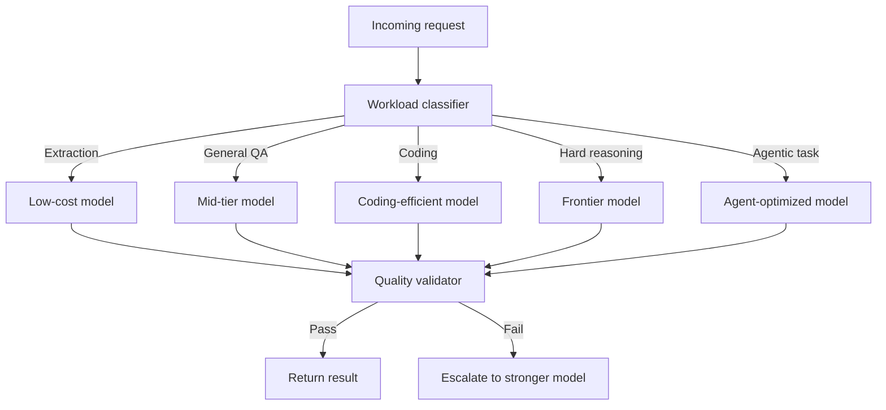
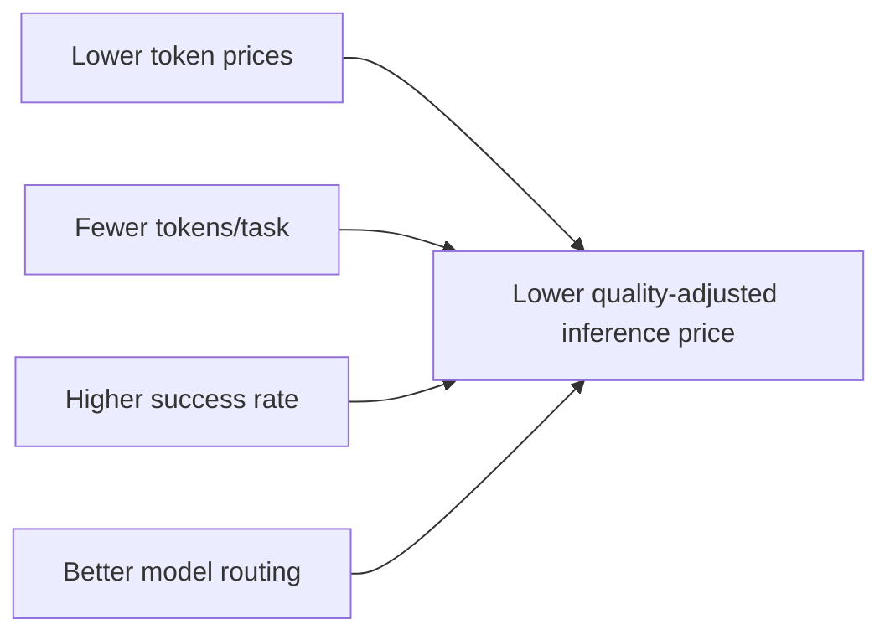

### A Quality-Adjusted Price Index for Large Language Models

> **Main Argument:** The economically relevant price of AI inference is not dollars per million tokens. It is the minimum cost of completing a workload at a fixed quality and service level.

Frontier-model pricing is usually compared using API rate cards. That comparison is increasingly misleading.

A model with a lower token price can require more reasoning tokens, fail more often, or need repeated attempts. A more expensive model can therefore be cheaper at the task level if it reaches the required result with fewer tokens or a higher probability of success.

The market increasingly has two prices:

* **Nominal price:** dollars per million input or output tokens.
* **Effective price:** dollars per successful task at a required quality and latency level.

The distinction matters because capability is improving at the same time that token prices are falling. A useful inference-price index therefore has to adjust for both.

### 1. The unit of analysis should be the task, not the token

For a workload with input tokens \(T_{in}\) and output tokens \(T_{out}\), the nominal API cost of model \(i\) is:

```math
C_i
=
p_i^{in}T_{in}
+
p_i^{out}T_{out}
```

For an illustrative **8,000-input / 2,000-output-token workload**, current list prices produce a wide range of request costs:

| Model               | Input $/M | Output $/M | 8K input + 2K output |
| ------------------- | --------: | ---------: | -------------------: |
| DeepSeek V4.1 Flash |     $0.30 |      $1.20 |          **$0.0048** |
| Grok 4.6            |     $2.00 |      $6.00 |          **$0.0280** |
| Claude Sonnet 5     |     $2.00 |     $10.00 |          **$0.0360** |
| Gemini 3.1 Pro      |     $2.00 |     $12.00 |          **$0.0400** |
| GPT-5.4             |     $2.50 |     $15.00 |          **$0.0500** |

#### Nominal request cost

```text
DeepSeek V4.1 Flash  █                                      $0.0048
Grok 4.6             ██████                                 $0.0280
Claude Sonnet 5      ███████                                $0.0360
Gemini 3.1 Pro       ████████                               $0.0400
GPT-5.4              ██████████                             $0.0500
```

On this basis alone, the cheapest and most expensive models differ by more than **10×**.

But this comparison holds token volume constant.

It does **not** hold task quality constant.

That makes it unsuitable as a price index for useful inference.

### 2. The first adjustment is success probability

Let \(q_i\) denote the probability that model \(i\) completes a task correctly.

If failed attempts are repeated independently until success:

```math
E[N_i]
=
\frac{1}{q_i}
```

Expected cost per successful task is:

```math
C_i^{success}
=
\frac{C_i}{q_i}
```

Consider two models:

|                           |    Model A |    Model B |
| ------------------------- | ---------: | ---------: |
| Cost per attempt          |     $0.020 |     $0.040 |
| Success probability       |        40% |        90% |
| Expected cost per success | **$0.050** | **$0.044** |

Model B has twice the nominal price per attempt but is **12% cheaper per successful task**.



This is the first reason token-price comparisons can produce the wrong ordering.

### 3. Production systems usually have finite retry budgets

Unlimited retries are rarely realistic.

Suppose a system allows at most \(K\) attempts. The probability of eventual success becomes:

```math
P(\text{success by }K)
=
1-(1-q)^K
```

Expected attempts are:

```math
E[N_K]
=
\sum_{k=1}^{K}(1-q)^{k-1}
=
\frac{1-(1-q)^K}{q}
```

Expected inference spend is:

```math
E[C_K]
=
C
\frac{1-(1-q)^K}{q}
```

This allows retry policy to become an explicit part of inference economics.

A useful calculator should therefore expose:

* no retry,
* maximum two attempts,
* maximum three attempts,
* retry until success.

This matters particularly for agentic and coding workloads, where failure is expensive but repeated attempts are common.

### 4. Reasoning effort has become a hidden price tier

Reasoning models introduce another complication.

The API price can remain constant while task-level cost changes substantially because higher reasoning settings generate more tokens.

A useful example is Grok 4.6. External benchmark measurements show roughly the following pattern:

| Reasoning level | Intelligence score | Approx. cost/task |
| --------------- | -----------------: | ----------------: |
| Low             |                 35 |         **$0.48** |
| Medium          |                 43 |         **$1.50** |
| High            |                 44 |         **$1.86** |
| xHigh           |                 44 |         **$2.32** |

#### Marginal economics of reasoning

```text
Quality
Low       ███████████████████████████████          35
Medium    ███████████████████████████████████████  43
High      ████████████████████████████████████████ 44
xHigh     ████████████████████████████████████████ 44

Cost/task
Low       ████████                                  $0.48
Medium    █████████████████████████                 $1.50
High      ███████████████████████████████           $1.86
xHigh     ██████████████████████████████████████    $2.32
```

Moving from medium to high increases measured task cost by approximately:

```math
\frac{1.86}{1.50}-1
\approx 24\%
```

Moving from high to xHigh increases cost by another:

```math
\frac{2.32}{1.86}-1
\approx 25\%
```

The aggregate quality score does not improve in this particular benchmark.

This does **not** prove that additional reasoning is useless. Aggregate benchmarks can miss tasks where deeper reasoning has substantial value.

It does show that reasoning effort is itself an economic variable.

The optimization problem is therefore better expressed as:

```math
\min_{i,e} C(i,e)
```

subject to:

```math
Q(i,e)\geq Q^*
```

where \(e\) is reasoning effort.

The strongest configuration is not necessarily the economically efficient one.

### 5. The relevant object is the quality-cost frontier

For each model, observe the pair:

```math
(Q_i,C_i)
```

where \(Q_i\) is workload quality and \(C_i\) is effective task cost.

Model \(i\) is economically dominated if another model \(j\) satisfies:

```math
Q_j\geq Q_i
```

and:

```math
C_j\leq C_i
```

with at least one strict inequality.

The remaining models form the **Pareto frontier**.



The procurement question is no longer:

> Which model is cheapest?

It becomes:

> Which model is cheapest among those that meet the required quality level?

Formally:

```math
P_t(q,w)
=
\min_i C_{itw}
```

subject to:

```math
Q_{itw}\geq q
```

where:

* \(t\) is time,
* \(w\) is workload,
* \(q\) is the minimum quality requirement.

### 6. The quality-adjusted price index

This gives a directly interpretable index:

```math
I_t(q,w)
=
100
\frac{P_t(q,w)}{P_0(q,w)}
```

If January 2025 is the base period:

```math
I_{Jan\,2025}=100
```

Suppose the cheapest model capable of satisfying the same quality requirement costs 60% less one year later.

Then:

```math
I_{Jan\,2026}=40
```

The economic interpretation is straightforward:

> The price of buying the same minimum level of useful AI capability has fallen by 60%.

This is more meaningful than saying the average API token price fell by 60%.

### 7. The index should be published at multiple quality floors

A single AI price index hides one of the most important features of the market.

The price of **adequate** intelligence and the price of **maximum** intelligence can move very differently.

Define frontier-relative quality as:

```math
\tilde Q_{it}
=
\frac{Q_{it}}{\max_j Q_{jt}}
```

Then define the qualifying model set:

```math
\mathcal M_t(q)
=
\{i:\tilde Q_{it}\geq q\}
```

For a 90% quality floor:

```math
P_t^{90}
=
\min_{i\in\mathcal M_t(0.90)} C_{it}
```

A complete index should therefore publish separate series for:

* **80% of frontier**
* **90% of frontier**
* **95% of frontier**
* **99% of frontier**

#### Illustrative index structure

> The values below illustrate the intended visualization and are **not measured historical results**.

| Period | 80% frontier | 90% frontier | 95% frontier | 99% frontier |
| ------ | -----------: | -----------: | -----------: | -----------: |
| Base   |          100 |          100 |          100 |          100 |
| T+1    |           61 |           68 |           77 |           91 |
| T+2    |           37 |           48 |           62 |           82 |
| T+3    |           22 |           33 |           51 |           75 |

```text
Quality-adjusted inference price index — Base = 100

100 ┤●     ●     ●     ●
 90 ┤                  ╲●  99%
 80 ┤                  ●
 70 ┤      ●        ╲
 60 ┤      ●     ●        95%
 50 ┤            ●
 40 ┤            ●          90%
 30 ┤                  ●
 20 ┤                  ●     80%
    └──────────────────────────
       Base   T+1   T+2   T+3
```

This is likely to be more informative than a single market-wide price series.

A plausible market structure is that **commodity-quality inference commoditizes much faster than the final few percentage points of frontier performance**.

The index is designed to test that hypothesis rather than assume it.

### 8. Quality improvement can lower price even when API rates do not change

There are two ways effective inference cost can decline.

#### Price effect

```math
p_t\downarrow
```

The provider cuts its rate per token.

#### Efficiency effect

```math
T_t\downarrow
```

The model needs fewer tokens, retries, or tool calls to produce the same acceptable result.

Task cost is:

```math
C_{\text{task}}
=
p_{in}T_{in}
+
p_{out}T_{out}
+
C_{\text{tools}}
+
C_{\text{retry}}
```

Therefore:

```math
\Delta C
=
\text{price effect}
+
\text{token-efficiency effect}
+
\text{success-rate effect}
+
\text{routing effect}
```

The market tends to track the first.

A quality-adjusted index captures all four.

This distinction is increasingly important as smaller models reproduce capabilities that previously required much larger systems.

The relevant technological event is not merely:

```math
\$3/M \rightarrow \$1/M
```

It can also be:

```math
\text{frontier capability at }t
\rightarrow
\text{mid-tier model at }t+1
```

That is a decline in the price of capability even if the headline API rate changes only modestly.

### 9. Latency should enter as a constraint

It is tempting to create an “effective cost” formula that assigns an arbitrary dollar penalty to latency.

That generally lacks a defensible economic basis.

One second of latency has very different value in:

* batch document processing,
* coding assistants,
* real-time voice,
* autonomous agents,
* customer support.

A cleaner formulation is:

```math
\min_i C_i
```

subject to:

```math
Q_i\geq Q^*
```

```math
TTFT_i\leq TTFT^*
```

and:

```math
TPS_i\geq TPS^*
```

Models that fail the service-level requirement should be excluded from the feasible set.



This produces a much cleaner economic interpretation than monetizing latency using an arbitrary coefficient.

### 10. A true hedonic index requires a regression

A metric such as:

```math
\frac{Price}{Benchmark\ Score}
```

is useful descriptively.

It is not a hedonic price index.

A proper hedonic specification treats model characteristics as product attributes.

Let \(P_{it}\) denote measured task cost. Estimate:

```math
\ln P_{it}
=
\alpha_t
+
\beta_1 Q^{coding}_{it}
+
\beta_2 Q^{reasoning}_{it}
+
\beta_3 Q^{agentic}_{it}
+
\gamma_1 \ln(TTFT_{it})
+
\gamma_2 \ln(TPS_{it})
+
\delta X_{it}
+
\varepsilon_{it}
```

Here:

* \(Q^{coding}\) measures software-engineering capability,
* \(Q^{reasoning}\) measures reasoning capability,
* \(Q^{agentic}\) measures tool use and long-horizon completion,
* \(X\) contains other product attributes,
* \(\alpha_t\) is the time effect.

The hedonic price index is:

```math
H_t
=
100
\exp(\alpha_t-\alpha_0)
```

This answers:

> How much has inference price changed after statistically controlling for observed quality characteristics?

The hedonic index should be published alongside the quality-floor index.

They answer different questions.

| Method                 | Question                                                     |
| ---------------------- | ------------------------------------------------------------ |
| Quality-floor frontier | What is the cheapest model that meets my requirement today?  |
| Hedonic regression     | How has price changed after controlling for product quality? |

Agreement between the two would provide strong evidence of genuine quality-adjusted price decline.

Disagreement would also be informative.

### 11. “AI quality” should not be represented by one benchmark

There is no universal scalar measure of model quality.

A coding agent, legal extraction system, voice assistant, and research model require different capabilities.

For workload \(w\), construct:

```math
Q_{iw}
=
\sum_{b=1}^{B} w_{bw} z_{ib}
```

with:

```math
\sum_b w_{bw}=1
```

The normalized benchmark score can be written as:

```math
z_{ib}
=
\frac{x_{ib}-\mu_b}{\sigma_b}
```

This avoids giving a benchmark more weight simply because its numerical scale has greater variance.

A production index should publish separate baskets:

| Index          | Main emphasis                                         |
| -------------- | ----------------------------------------------------- |
| **Coding**     | repository tasks, debugging, software engineering     |
| **Reasoning**  | mathematics, science, multi-step reasoning            |
| **Agentic**    | tools, browsers, terminals, long-horizon completion   |
| **General**    | balanced benchmark basket                             |
| **Enterprise** | reliability, structured output, instruction following |

The output is therefore a **family of inference price indices**, not one universal score.

```math
I_t^{coding},
\quad
I_t^{reasoning},
\quad
I_t^{agentic},
\quad
I_t^{general}
```

### 12. Model routing converts quality dispersion into economic value

Once quality is expressed as a constraint, routing becomes a standard optimization problem.

Suppose workload \(w\) occurs \(n_w\) times.

Using one model for everything costs:

```math
C_{base}
=
\sum_w n_w C_{bw}
```

A router instead chooses:

```math
i_w^*
=
\arg\min_i C_{iw}
```

subject to:

```math
Q_{iw}\geq q_w^*
```

and the relevant latency requirements.

Total routed cost becomes:

```math
C_{route}
=
\sum_w n_w C_{i_w^*,w}
```

Savings are:

```math
S
=
1-
\frac{C_{route}}{C_{base}}
```

#### Example routing architecture



This creates an important shift in how enterprises should think about inference procurement.

A company is not necessarily choosing **a model**.

It is choosing a **portfolio of models subject to quality constraints**.

### 13. The market is separating into different economic regimes

The current model market can be understood as three broad layers.

#### Commodity inference

Low-cost models increasingly serve:

* extraction,
* classification,
* summarization,
* basic chat,
* simple code generation.

In this segment, token pricing is moving toward infrastructure-like economics.

#### Near-frontier inference

These models serve workloads where capability matters but maximum intelligence is unnecessary.

This is likely to be the area with the greatest substitution and routing opportunity.

#### Maximum-capability inference

The last few points of model capability remain expensive.

These models are economically rational when the value of success is high enough to dominate the additional inference cost.

The cost curve may therefore look approximately like this:

```text
Cost
 ^
 |                                      ● Frontier-max
 |                               ●
 |                         ●
 |                 ●
 |         ●
 |    ●
 | ●
 +------------------------------------------------> Quality
   Commodity        Near-frontier         Frontier
```

The important feature is the curvature.

If marginal quality becomes increasingly expensive near the frontier:

```math
\frac{\partial^2 C}{\partial Q^2}>0
```

then large cost savings become available whenever an application can tolerate slightly less than maximum capability.

### 14. Falling inference prices do not imply falling AI infrastructure demand

A quality-adjusted price decline can increase aggregate compute consumption.

Let demand elasticity be:

```math
\epsilon_D
=
\frac{\%\Delta Q_D}{\%\Delta P}
```

If:

```math
|\epsilon_D|>1
```

then a decline in effective price increases total spending.

This is plausible for AI because cheaper inference makes previously uneconomic workloads viable.

Examples include:

* continuous code review,
* background enterprise agents,
* personalized tutoring,
* large-scale document processing,
* synthetic-data generation,
* autonomous research,
* multi-agent workflows.

The relevant infrastructure equation is:

```math
\text{Total Compute Demand}
=
\text{Number of Tasks}
\times
\text{Compute per Task}
```

Efficiency can reduce compute per task while simultaneously increasing the number of tasks by a larger amount.

There is therefore no contradiction between:

> **quality-adjusted inference prices falling rapidly**

and

> **accelerator demand continuing to rise.**

### 15. Required dataset

A credible living index should preserve the following information for every observation.

| Category           | Required fields                                  |
| ------------------ | ------------------------------------------------ |
| **Model identity** | provider, model, version, release date           |
| **Price**          | input, cached input, output, batch, tool fees    |
| **Workload**       | task type, context length, expected output       |
| **Quality**        | benchmark, score, evaluator, run configuration   |
| **Consumption**    | input tokens, reasoning tokens, output tokens    |
| **Reliability**    | pass rate, retry rate, structured-output failure |
| **Latency**        | TTFT, median TPS, P95 latency                    |
| **Availability**   | region, API endpoint, retirement date            |
| **Provenance**     | source, capture date                             |

Every historical observation should be immutable:

```math
(model,\ version,\ date,\ provider,\ configuration)
```

This matters because AI products change faster than conventional goods.

Replacing an old model endpoint with a new version and backfilling its current performance would rewrite historical price data.

A living index cannot do that.

### 16. Recommended dashboard structure

The research product should have five views.

#### Index

**How quickly is quality-adjusted inference getting cheaper?**

Primary visualization:

```text
Quality-Adjusted Inference Price Index
Base period = 100

80% frontier  ───────────────╲____
90% frontier  ─────────────────╲____
95% frontier  ────────────────────╲___
99% frontier  ───────────────────────╲__
```

#### Frontier

**Which models currently sit on the efficient quality-cost frontier?**

Display:

* cost per successful task,
* quality,
* latency,
* throughput,
* dominated/efficient status.

#### Calculator

**What does my workload actually cost?**

Inputs:

* workload,
* input tokens,
* output tokens,
* reasoning effort,
* retry limit,
* quality floor,
* latency SLO.

#### Router

**How much can I save without violating my quality requirements?**

Compare:

```math
C_{single-model}
```

with:

```math
C_{optimized-router}
```

#### Methodology

Expose:

* source observations,
* equations,
* benchmark weights,
* regression specification,
* index-rebalancing rules,
* revision history.

### 17. Main risks to the index

A quality-adjusted inference price index has four important limitations.

#### Benchmark quality is not production quality

Public benchmarks may not reflect proprietary workloads.

The index should therefore allow enterprise-specific evaluation baskets.

#### Retry failures are correlated

The simple model:

```math
E[N]=\frac{1}{q}
```

assumes independent attempts.

In practice, a model that fundamentally misunderstands a task may fail repeatedly.

Conditional retry probabilities should therefore be measured directly when possible.

#### Enterprise prices differ from list prices

Volume discounts, batch pricing, caching, committed-use contracts, and negotiated pricing can materially change the ordering.

The public index should use auditable list prices.

Enterprise users can substitute their own prices in the calculator.

#### Quality is endogenous to inference spend

Higher reasoning effort, larger context windows, more tool calls, and additional verification can all increase both quality and cost.

The model configuration—not merely the model name—is therefore the correct unit of observation.

### Conclusion

The inference market is moving away from a market for tokens and toward a market for **completed cognitive work**.

The correct economic object is not:

```math
\frac{\$}{1M\ tokens}
```

It is:

```math
\boxed{
\text{Cost per successful task at a fixed quality and service level}
}
```

For workload \(w\), required quality \(q\), and service requirement \(s\), define the frontier price as:

```math
\boxed{
P_t(q,s,w)
=
\min_i C_{itw}
}
```

subject to:

```math
Q_{itw}\geq q
```

and:

```math
S_{itw}\geq s
```

The associated price index is:

```math
\boxed{
I_t(q,s,w)
=
100
\frac{P_t(q,s,w)}
{P_0(q,s,w)}
}
```

This framework captures four sources of economic improvement simultaneously:



The distinction matters because all four are occurring at once.

Nominal token prices are falling. Models are becoming more token-efficient. Smaller models are reaching quality levels that previously required frontier systems. Routing makes it possible to purchase expensive intelligence only when a workload actually requires it.

A conventional token-price series captures only the first effect.

A quality-adjusted inference price index captures the economic result.
